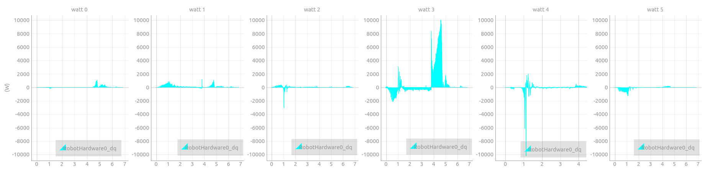
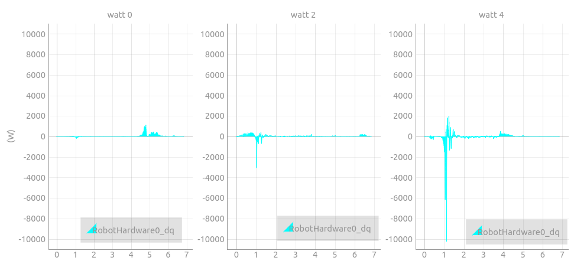

# log-plotter
## Sample Usage
```
python datalogger-plotter-with-pyqtgraph.py -f file-name --plot plot.yaml --layout layout.yaml
```
ex)  
when you want to plot watt of each joint, you need to set following two file.

layout.yaml
```
- "group": "watt"
  "indices": [[0,1,2,3,4,5]]
```
plot.yaml
```yaml:plot.yaml
"watt":
  "log": [['RobotHardware0_dq','RobotHardware0_tau']]
  "func":[[plot_watt]]
  "arg_index": [[0,0]]
  "pen":["watt"]
```

## About config file
### layout.yaml
layout.yaml defines the number of each legend.  
Since one leg has 6 joint, "watt" legend is 6 dimension array.  
When you want to plot "watt" legend for all joint, you should set indices `[0,1,2,3,4,5]`.  
  
When you want to plot "watt" legend for only joint 0,2, and 4, you should set indices `[0,2,4]`.  
  

### plot.yaml
plot.yaml defines how to calculate value for each legend.  
Values for most of legend are obtaind by reading file only,  
but "watt" leggend, for example, is obtained by multiplying torque and joint velocity.

In plot.yaml, the way to caliculate "watt" legend is defined.  
First, you defines the port name to use.
```
"log": [['RobotHardware0_dq','RobotHardware0_tau']]
```
Second, you defines the function to calculate "watt" legend.  
This function is defined in `plot_method.py`.
```
"func":[[plot_watt]]
```
Third, you defines index of argument used in the function above.  
In this case, `plot_watt` function use index of `RobotHardware0_dq[0,1,2,3,4,5]` and `RobotHardware0_tau[0,1,2,3,4,5]`.  
The indices for `RobotHardware0_dq` and `RobotHardware0_tau` is the same and `[0,1,2,3,4,5]` is defined in `layout.yaml`.
Therefore, "arg_index" is [[0,0]].  
First 0 means arg_index for `RobotHardware0_dq` is 0th indices.  
Second 0 means arg_index for `RobotHardware0_tau` is also 0th indices.

## For Daily Experiment
### Tips

##### Left Click

###### Ubuntu earlier than 14.04
save the following commands as ~/.gnome2/nautilus-scripts/hrpsys-plot.sh and ``chmod +x ~/.gnome2/nautilus-scripts/hrpsys-plot.sh`` and then ``nautilus -q``

###### ubuntu14.04 or above
save the following commands as ~/.local/share/nautilus/scripts/hrpsys-plot.sh and ``chmod +x ~/.local/share/nautilus/scripts/hrpsys-plot.sh`` and then ``nautilus -q``

```bash
#!/bin/bash
gnome-terminal -t "aho" -x $SHELL -ic '$HOME/kuroiwa_demos/python/hrpsys-plot/datalogger-plotter-with-pyqtgraph.py -f ${NAUTILUS_SCRIPT_SELECTED_FILE_PATHS%.*} --conf $(zenity --file-selection --filename="$HOME/kuroiwa_demos/python/hrpsys-plot/config/default.yaml" --file-filter=*.yaml)'
exit
```

###### Ubuntu earlier than 14.04
save the following commands as ~/.gnome2/nautilus-scripts/trim.sh and ``chmod +x ~/.gnome2/nautilus-scripts/trim.sh`` and then ``nautilus -q``

###### ubuntu14.04 or above
save the following commands as ~/.local/share/nautilus/scripts/trim.sh and ``chmod +x ~/.local/share/nautilus/scripts/trim.sh`` and then ``nautilus -q``

```bash
#!/bin/bash
gnome-terminal -t "aho" -x $SHELL -ic '$HOME/myrepo/kuroiwa_demos/python/hrpsys-plot/datalogger-trimmer.py -f $NAUTILUS_SCRIPT_SELECTED_FILE_PATHS --min $(zenity --entry --text="minimum time[s]") --max $(zenity --entry --text="maximum time[s]")'
exit
```
