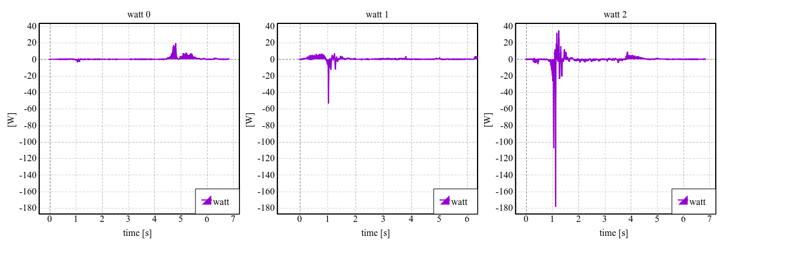

# log_plotter
## インストール方法
### catkin packageとしてインストール
1. 依存パッケージの導入
```bash
sudo pip install metayaml pyqtgraph
```
2. パッケージのbuild
```bash
cd catkin_ws/src
git clone https://github.com/kindsenior/log_plotter.git
cd log_plotter
catkin build --this
```

### pip でインストール
```bash
pip install git+https://github.com/kindsenior/log_plotter.git
```

## 使用方法
### 1. コマンドラインで
```
datalogger_plotter_with_pyqtgraph.py -f file-name [--plot plot.yaml] [--layout layout.yaml]
```

### 2. nautilusから右クリックで
buildすると、以下のディレクトリにplot.shへのシンボルリンクが貼られる。
- ubuntu12.04以前  
~/.gnome2/nautilus-scripts/
- ubuntu14.04以降  
~/.local/share/nautilus/

hrpsysのファイルを  
```
右クリック→スクリプト→plot.sh
```
と選択し、plot.yaml, layout.yamlを選択を行い,"OK"をクリックする。

## 設定ファイルの記述方法

### layout.yaml
右足の関節角度の時間変化を表すグラフを描画する例。  
以下のように記述すると、`joint_angle(rleg)`というタイトルのグラフが横一列に7つ並ぶ。  
描画の詳細は`plot.yaml`と`src/log_plotter/plot_method`で定義されている。
`extend:`で別のyamlファイルをincludeできる。
```yaml
extend:
  ../../st_layout.yaml

main:
  joint_angle(rleg):
    legends:
      - { key: sh_qOut, id: [0-6] }
      - { key: abc_q, id: [0-6] }
      - { key: st_q, id: [0-6] }
      - { key: RobotHardware0_q, id: [0-6] }
 ```
`id: [0-6]`は、`id: [0,1,2,3,4,5,6]`と記述するのと同等で、関節idの0~6に対応している。

この例では一つのグラフに、4つの凡例(`sh_qOut`, `abc_q`, `st_q`, `RobotHardware0_q`)が描画される。
```yaml
- { key: sh_qOut, id: [0-6] }
```
は、plot.yamlの中で定義されている`sh_qOut`の0~6番を描画することを意味する。

#### 例
```yaml
  watt:
    legends:
      - { key: watt, id: [0-5] }
```
  
```yaml
  watt:
    legends:
      - { key: watt, id: [0,2,4] }
```
  

#### オプション
グラフ毎にオプションを付けることで細かい設定をすることができる．
* `newline: bool (default: True)`  
Falseにすることで前にグラフと同じ行に表示することができる
* `title: bool`  
Falseにすることでグラフ上部のタイトルを非表示にする
* `bottom_label: 'string' (default: "time [s]")`  
横軸ラベルを設定
* `left_label: 'string' (default: False)`  
縦軸ラベルを設定
* `xRange: {min: float, max: float, zero: bool})`  
横軸のrangeを設定．それぞれ必須ではない(zero == Trueの時のみminが必要)．zero == Trueとするとグラフの開始を0に合わせることができる．
* `yRange: {min: float, max: float})`  
横軸のrangeを設定．それぞれ必須ではない．
* `downsampling: {ds: float, auto: bool, mode: 'string'} (default: {ds: 100, auto: False, mode: 'peak'})`  
setDownsamplingを使用するための設定．

### plot.yaml
plot.yamlは凡例ごとの描画方法を記述している。  
通常は、plot.yamlで定義された凡例をlayout.yamlの中で組み合わせて使用することを想定している。  
各関節の消費電力であるwattの場合、以下のように記述されている。  
`data`の中では、消費電力に必要なログファイルについて記述する。  
消費電力をプロットするのに必要なログは、各関節の関節速度`RobotHardware0_dq`と各関節のトルク`RobotHardware0_tau`なので、そのファイル名が、`log:`に続いて指定されている。
`column`では、ログファイルの何列目の値が使用されるかを指定している。  
消費電力の計算では、関節速度と関節トルクの掛け算を行う。その計算を行う関数の名前が、`func: plot_watt`で指定されており、
`plot_method.py`の中に、`plot_watt`が定義されている。
`extend:`で別のyamlファイルをincludeできる。

```yaml:plot.yaml
extend:
  ../../common_plot.yaml

watt:
  func: plot_watt
  data:
    - { log: RobotHardware0_dq, column: [0-33]  }
    - { log: RobotHardware0_tau, column: [0-33] }
```

